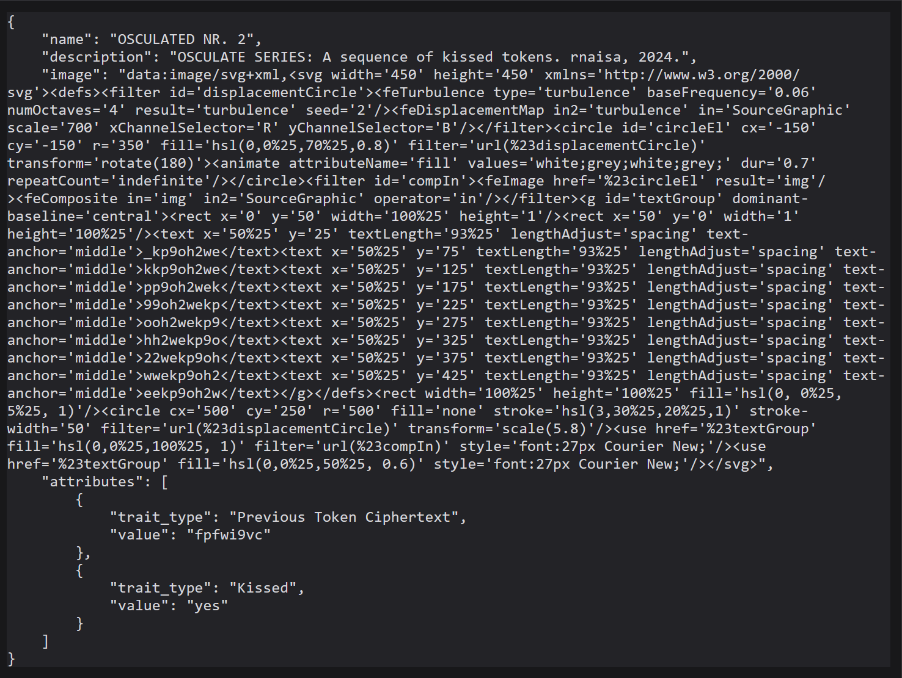

# OSCULATE SERIES

"OSCULATE SERIES" is an NFT smart contract, where each newly minted NFT can "osculate" (kiss) the previous one using Vigenère encryption and thus forming a sequence of digital romance.

It was developed as a mentoring project over a semester at the Digital Ideation programme at Lucerne University of Applied Sciences. 

<table style="width: 50px;">
    <tr>
        <th style="text-align: center; border: none;">unkissed</th>
        <th style="text-align: center; border: none;">kissed</th>
    </tr>
    <tr>
        <th style="text-align: center; border: none;"></th>
        <th style="text-align: center; border: none;"></th>
    </tr>
    <tr>
        <th style="text-align: center; border: none;"></th>
        <th style="text-align: center; border: none;"></th>
    </tr>
</table>

The NFT's metadata, which is generated on-chain, includes an SVG image containing the ciphertext and utilizes the tokenId to create deterministic visual characteristics. The metadata changes when the requirements for being "kissed" are met.

## How does it work?

The contract mints the first token with the ciphertext `osculate` to the deployer's address.

Upon initiating a mint (for 1 GWei), the last 8 lowercase characters of the minter's address are used as the key to Vigenère cipher the plaintext (which is also a ciphertext) of the previous - last minted - token. This triggers a "kiss" and the chain of ciphertexts continues.

### Vigenère Cipher

The Vigenère cipher is a way to encrypt a message by shifting letters based on a keyword. Each keyword letter tells you how many steps to move each letter of the plaintext in the alphabet. You repeat the keyword to match the length of your message and then shift each letter accordingly, but in our case, the keyword is always as long the previous ciphertext (8 characters). Our alphabet contains all lowercase letters and numbers.

#### Example:

|  |  |
| ----------- | ----------- |
| **PlainText to cipher:** | `osculate` |
| **Minter's address:** | `0xAb5801a7D398351b8bE11C439e05C5B3259aeC9B` |
| **Key:** | `259aec9b` _last 8 address lowercase letters_|
| **Alphabet:** | `abcdefghijklmnopqrstuvwxyz0123456789` |

</br>

#### Cipher Process:
```
plaintext                                        key        ciphered text

    o   → shift in the alphabet by the index of   2           →   ?
    s                                             5           →   ?      
    c                                             9           →   ?  
    u                                             a           →   ?  
    l                                             e           →   ?  
    a                                             c           →   ?  
    t                                             0           →   ?  
    e                                             b           →   ?  
```

We can use a Vigenère table with our alphabet to assist in finding the characters of the resulting ciphertext.

#### Vigenère Table


We look for the first character of `osculate` to cipher (`o`) in the first column and the first letter of the keyword `259aec9b` (`2`) in the first row. 

The resulting character is `g`.

>**Resulting cipher text after repeating this step for all characters:** `gnbupcsf`.

<figure>
    
    <figcaption>Generated NFT SVG image with the new ciphertext</figcaption>
</figure>

## SVG

The NFT's metadata is returned as a data URI with descriptions, the token's SVG image and the attributes `Previous Token Ciphertext` and `Kissed`.

<figure>
    
    <figcaption>Browser showing metadata of the token with the tokenId 2.</figcaption>
</figure>

### Visual Characteristics
The SVG image contains an Vigenère-table-inspired pattern of the text that the minter has ciphered with their address. The tokenId is used to generate token-specific settings for the SVG image. **This includes the pattern's ciphered text, the seed, the color, and the scale (definition) of the background pattern.**

Each newly minted token's image has a normal heartbeat animation and the color's saturation value
set to 0 (black & white), which changes once the token has been kissed. If kissed, the SVG image will have a faster heartbeat animation and the color appears.
  

## Deployment Demo

This contract has been developed with the Ethereum development environment [Hardhat](https://hardhat.org/) and [remix.ethereum.org](https://remix.ethereum.org/). Remix offers an IDE with tutorials that allows easy smart contract deployments and interactions with it.

While this repository stores all files and tests related to the contract, any interactions with it are the easiest to do and visualized in the Remix IDE!


#### To try the **Osculate** contract yourself, follow these steps:

- Open [remix.ethereum.org](https://remix.ethereum.org/)
- Load the `Osculate.sol` contract file from the `contracts` folder into the IDE, compile it and deploy it on the default **Remix VM (Cancun) ONLY!**

- Interact with the contract by choosing another wallet address, putting in a value of 1 Gwei (the cost for an OSCULATED NFT) and pressing on `mint`

- Since now 2 tokens exist, you can run the function `tokenURI` with the tokenId values `0` (owned by the contract deployer address) and `1` (owned by the address you just minted with)

- Copy and paste the resulting data URI into a browser (preferably Chrome) to see the metadata. The animation currently doesn't work in Firefox due to a bug.

- Copy and paste the SVG code in a new tab to see the SVG image


**Disclaimer:** Proceed with these steps at your own risk. Take precautions to protect any sensitive information.

## License 
Copyright (c) 2024 rnaisa

This program is free software: you can redistribute it and/or modify
it under the terms of the GNU General Public License as published by
the Free Software Foundation, version 3 of the License.

This program is distributed in the hope that it will be useful,
but WITHOUT ANY WARRANTY; without even the implied warranty of
MERCHANTABILITY or FITNESS FOR A PARTICULAR PURPOSE.  See the
GNU General Public License for more details.

You should have received a copy of the GNU General Public License
along with this program. If not, see <https://www.gnu.org/licenses/>.
